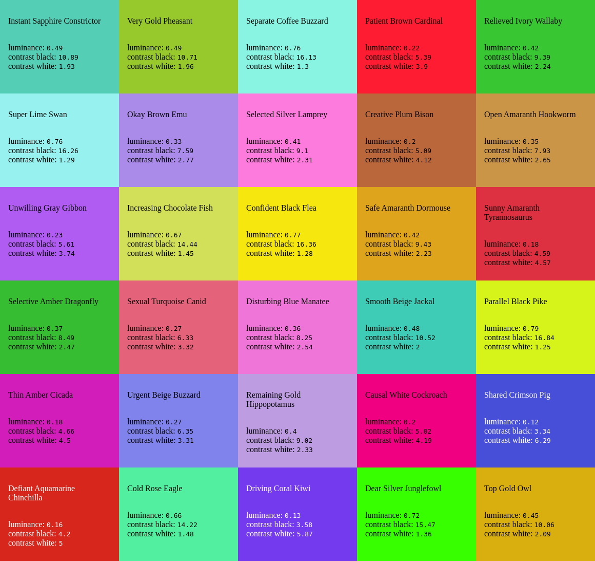

# ColorHasher

ColorHasher is a utility library for generating consistent color hashes from strings.
It also provides functionality to convert colors between HSL and RGB formats, calculate luminance, and determine contrast ratios.

ColorHasher can be useful for generating consistent colors for strings, such as user names, identifiers, or any other string data.



## Installation

User npm to install ColorHasher:

```bash
npm install @hochleistungslabor/color-hasher
```

## Usage

The package's main function `colorHash(str)` computes a color for a given string.

## Example

```js
import {
  ColorHashResult,
  colorHash,
} from "@hochleistungslabor/color-hasher";
const exampleString = "example";

const result: ColorHashResult = colorHash(exampleString);
const {hue, saturation, lightness} = result.hsl;

console.log(`Use the following color for the string ${exampleString}:`)
console.log(`HSL: hsl(${hue}, ${saturation}%, ${lightness}%)`);
console.log("RGB:", result.rgb);
console.log("Hex representation:", result.hex);
console.log("the color has a luminance of:", result.luminance);
const fontColor = result.contrastWithBlack > result.contrastWithWhite ? "black" : "white";
console.log(`If you use the color for the background you should use ${fontColor} for the font`);

```

## API

### Interfaces

#### ColorHasherHSL

Represents a color in HSL format.

- `hue: number` - Hue in the range [0, 360].
- `saturation: number` - Saturation in the range [0, 100].
- `lightness: number` - Lightness in the range [0, 100].

#### ColorHasherRGB

Represents a color in RGB format.

- `red: number` - Red in the range [0, 255].
- `green: number` - Green in the range [0, 255].
- `blue: number` - Blue in the range [0, 255].

#### ColorHashResult

Contains the result of a color hash computation.

- `hsl: ColorHasherHSL` - The HSL representation of the hash color.
- `rgb: ColorHasherRGB` - The RGB representation of the hash color.
- `hex: string` - The hex string representation of the color (#123456).
- `luminance: number` - The luminance of the color.
- `contrastWithBlack: number` - The color's contrast ratio with black.
- `contrastWithWhite: number` - The color's contrast ratio with white.

### Functions

#### modulo(n: number, m: number): number

Calculates the proper modulo of `n` by `m`, which will be positive for positive `m`s.

#### hslToRgb(hsl: ColorHasherHSL): ColorHasherRGB

Converts an HSL color value to RGB.

#### calculateLuminance(rgb: ColorHasherRGB): number

Calculates the luminance of an RGB color.

#### stringHashHSL(str: string): ColorHasherHSL

Computes an HSL color hash from a string.

#### colorHash(str: string): ColorHashResult

The main function computes a color hash from a string, returning HSL and RGB representations, luminance, and contrast ratios.

## Contributing

Contributions are welcome! Please open an issue or submit a pull request on GitHub.
